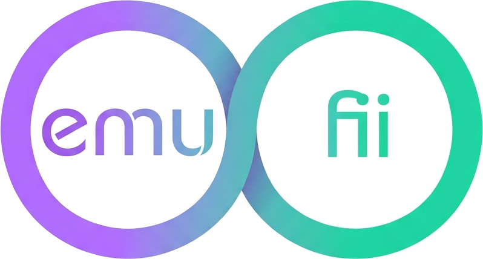

<div align="center">

# Emufii



**One code, and you're in the same room.**

Emufii puts your devices on a single network for as long as you're playing.
Your emulators find each other exactly as they would over local Wi-Fi.

**Builds are handed out on Discord for now.** There is nothing to download here
yet: come and say hello, and you'll get the current one.

<br>

[](https://discord.gg/tvWcb28vBZ)
[](LICENSE)

[](#install)
[](#consoles)

[](https://discord.gg/tvWcb28vBZ)
[](https://ko-fi.com/emufii)

<br>

**[Download](https://discord.gg/tvWcb28vBZ)** •
[Install](#install) •
[Consoles](#consoles) •
[Privacy](#privacy) •
[Discord](https://discord.gg/tvWcb28vBZ)

</div>

---

## What it does

Playing an emulator with a friend across the country used to mean forwarding a
port, digging up your public IP, sending it over, typing it in on both ends, and
starting again when your ISP changed it.

Emufii replaces all of that with a six-character code.

| | |
|---|---|
| **1. The host opens a session** | Pick a game, get a code. |
| **2. The code gets around** | Say it, paste it, or let your friends find the game in the list of open sessions. |
| **3. The guest joins** | Emufii opens the emulator on its multiplayer screen and fills in the address for them. |
| **4. You play** | Both sides need the same game. |

Where the host has to open the room first, the guest's button says so and waits
instead of sending them into an emulator with nothing to find.

Emufii emulates nothing and implements no netplay of its own. It opens a
session, shares a network, and lets the emulator do what it already knows how to
do.

## Consoles

These emulators are installed separately, from their own sites. Emufii launches
them and stays out of the way.

| Console | Emulator | Worth knowing |
|---|---|---|
| **3DS** | [Azahar](https://azahar-emu.org) | Grab a **pre-release ≥ 2126.0-rc**. Earlier stable builds have no multiplayer screen at all. |
| **Switch** | [Eden](https://eden-emu.dev) | The lobby runs on our server, so nobody has to host the game from their phone. Any Eden build is picked up, including the Optimized one that installs under another name. |
| **Wii** and **GameCube** | [Dolphin](https://dolphin-emu.org) | Dolphin's own netplay, which reached Android in 2026. You need a **dev build**: the netplay screen is not in release 2606a. Both players need the same dump. |
| **PSP** | [PPSSPP](https://www.ppsspp.org) | The console's own ad hoc mode, between two devices that are no longer in the same room. |
| **DS** | [melonDS](https://melonds.kuribo64.net) | **Online** play through Kaeru WFC. On AYN handhelds the preinstalled build is melonDS DualS. |

<details>
<summary><b>What won't work, and why</b></summary>

<br>

None of these are missing features. They're facts that sit outside the project.

- **DS local wireless.** The DS radio is emulated down at the physical layer,
  timing and all. No tunnel gets underneath that, and the melonDS authors say so
  themselves. DS online play is unaffected.
- **Nintendo's own Wii servers.** Reaching them through Wiimmfi needs a NAND
  dump from a real console, and a NAND can't be shared: handing one around gets
  the original console banned. Playing Wii and GameCube games together does not
  go that way — it goes through Dolphin's netplay, which needs none of it.

</details>

## No games, no BIOS, no keys

Emufii ships none of them and never will. You bring your own dumps of your own
cartridges and discs. This is a rule of the project rather than an oversight,
and every release is checked against the binary before it goes out.

## Install

The app is signed but distributed outside any store, so Android will warn you
about an unknown source. It isn't on this page either: while the project finds
its feet, builds go out through [Discord](https://discord.gg/tvWcb28vBZ) so that whoever installs
one can say what broke.

**1. Install the emulators** you plan to use, from the sites in the table above.

**2. [Ask for the build on Discord](https://discord.gg/tvWcb28vBZ)** and install it.

**3. Open Emufii and walk through setup:** your games folder, a nickname,
notifications, and the autofill permission.

The app speaks English and French, and comes in light, dark and OLED black. All
three are in the profile page, along with the folder you scan for games.

### The autofill permission, and why it looks broken

Emufii can type the session address into the emulator's multiplayer screen so
you never have to copy it by hand. That runs as an accessibility service, and
Android treats those as a **restricted setting** for anything installed outside
a store. The toggle stays greyed out until you say otherwise.

> **App info → ⋮ menu, top right → "Allow restricted settings"**, then go back
> to Settings → Accessibility and switch Emufii on.

Turning it down costs you nothing but a few seconds of typing, since the address
is shown in the session anyway. Emufii only ever reads the screens of the
emulators it declares, and only while a session you started is running.

### Checking the APK is ours

Every build of Emufii carries this certificate:

```
21:EF:2D:D6:11:E0:96:5A:70:8F:61:F6:00:77:DE:97:D4:0D:59:FD:56:2F:1D:C5:F6:EF:6C:87:77:5E:81:D5
```

```sh
apksigner verify --print-certs Emufii-1.11.4.apk
```

A copy carrying any other signature isn't ours, and Android will refuse to
install it over a genuine Emufii regardless.

## Privacy

- Your profile picture never leaves the device. Neither does your friends list.
- The server holds a session code, a nickname, a game title, and an address that
  lives as long as the game does. Nothing survives the session.
- The tunnel carries session traffic and nothing else. Your browsing, your app
  updates, everything else: none of it passes through our machines.
- No cloud backup, and no device transfer. Console keys the app can read stay on
  the phone.

### Before you join strangers

A session is a network shared between its players. That's what makes the
multiplayer work, and it's worth understanding what it implies. Sessions are
walled off from one another, but inside a session the devices can reach each
other. Joining a public room is close to plugging into a stranger's home
network, and deserves the same caution.

Between people who already know each other, the code travels hand to hand and
the game never appears in any list.

## Updates

Emufii tells you when a newer build exists and can install it for you. It
downloads only from its own server, and it verifies the signature before
offering you anything: a build that doesn't carry our key is refused, and so is
a rollback to an older one.

Nothing installs until you tap Install.

## License

**AGPL-3.0.** See [`LICENSE`](LICENSE) and [`NOTICE.md`](NOTICE.md).

In plain terms: study it, change it, pass it on. Whatever you build from it
carries the same licence and ships its source, including when you only ever run
it as a service. Nobody gets to close this code and sell it back.

The Emufii name and the logo are not part of that grant. Forks are fine. Forks
calling themselves Emufii are not.

The server side, which brokers sessions and runs the relay, is a separate
program and is not published. Copyright stays with the project, so terms outside
the AGPL can be arranged: ask on [Discord](https://discord.gg/tvWcb28vBZ).

Poppins is used under the SIL OFL 1.1, whose text ships inside the APK at
`assets/POPPINS-OFL.txt`.

The app source is not published yet, and neither are the builds: this page
exists to say what Emufii is and what it does with your data, before you decide
to ask for it on [Discord](https://discord.gg/tvWcb28vBZ).
