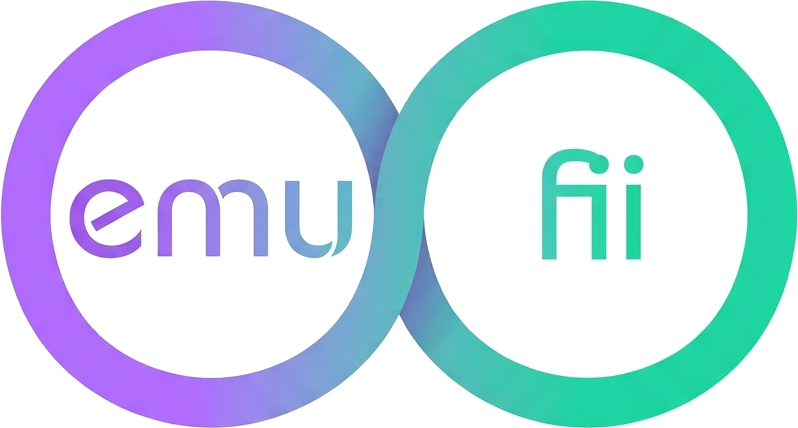

<div align="center">



# Emufii

**Play your emulators online with friends, using a six-character code.**<br>
No ports to open, no IP address to share. Built for Android handhelds.

<br>

[](https://discord.gg/tvWcb28vBZ)
[](https://github.com/jojodogm-ctrl/emufii/releases/latest)
[](COMPATIBLE-GAMES.md)
[](https://github.com/jojodogm-ctrl/emufii/releases/latest)
[](LICENSE)
[](https://ko-fi.com/emufii)

</div>

---

## How it works

1. **The host** picks a game and gets a code.
2. **Friends** enter the code, or find the game in the list of public sessions.
3. **Emufii** opens the emulator on its multiplayer screen and fills in the connection details.
4. **You play**, as if you were all on the same Wi-Fi.

Emufii doesn't emulate anything itself. It connects your devices, then each
emulator uses the multiplayer it already has.

## Features

- 🎮 **7 consoles**: Switch, 3DS, Wii, GameCube, PSP, PS2 and DS
- 🔑 **One code to join**, with private sessions or a public list
- ⚡ **Automatic setup**: Emufii opens the emulator and types the address for you
- 📚 **Game library** with covers, search, and grid, carousel or list views
- 🟢 **Compatibility badge** on every game, based on a list of [3,400+ games](COMPATIBLE-GAMES.md)
- 🕹️ **Built for gamepads**, with touch support too
- 🖥️ **Second screen** support on the AYN Thor
- 🎨 **Light, dark and OLED themes**, in English and French

## Consoles

| Console | Emulator | Multiplayer mode | Version needed |
|---|---|---|---|
| **Switch** | [Eden](https://eden-emu.dev) | Local wireless | Any recent version |
| **3DS** | [Azahar](https://azahar-emu.org) | Local wireless | Pre-release 2126.0-rc or newer |
| **Wii / GameCube** | [Dolphin](https://dolphin-emu.org) | Netplay | Android build `2606a` |
| **PSP** | [PPSSPP](https://www.ppsspp.org) | Ad hoc | Any recent version |
| **PS2** | [ARMSX2](https://github.com/ARMSX2/ARMSX2) | System Link / LAN | Any recent version |
| **DS** | [melonDS](https://melonds.kuribo64.net) | Online via [Kaeru WFC](https://kaeru.world) | Any recent version |

**Which games work?** Games that had local multiplayer on the original console.
For the DS, it's games that used Nintendo Wi-Fi Connection. Games that needed
Nintendo's or Sony's online servers don't work.<br>
**➜ [Full list of compatible games](COMPATIBLE-GAMES.md)**

Every player needs the same emulator version and the same copy of the game.

## Install

> ⚠️ **Beta.** Works on Android 13, 14 and 15. Expect bugs, and
> please report them on [Discord](https://discord.gg/tvWcb28vBZ).

1. Install the emulators you want to use.
2. [Download the latest APK](https://github.com/jojodogm-ctrl/emufii/releases/latest) and install it.
3. Open Emufii and follow the setup.

**Is the autofill option greyed out?** Android blocks it for apps installed
outside a store. Go to **App info → ⋮ → Allow restricted settings**, then turn
Emufii on in **Settings → Accessibility**.

**To update**, download the new APK from the
[releases page](https://github.com/jojodogm-ctrl/emufii/releases) and install it
over the old one. Your settings are kept.

<details>
<summary><b>Check the APK signature</b></summary>

```
21:EF:2D:D6:11:E0:96:5A:70:8F:61:F6:00:77:DE:97:D4:0D:59:FD:56:2F:1D:C5:F6:EF:6C:87:77:5E:81:D5
```

```sh
apksigner verify --print-certs Emufii-1.13.apk
```

</details>

## Privacy

- Your profile picture and friends list stay on your device.
- The server only sees the session code, your nickname and the game, and deletes them when the session ends.
- Only game traffic goes through Emufii.
- Emufii includes no games, BIOS files or keys, so use your own dumps.

In a public session, other players' devices can reach yours, like on shared
Wi-Fi. If you're playing with friends, keep the session private.

## License

[AGPL-3.0](LICENSE) (details in [NOTICE.md](NOTICE.md)). The app's source code
is in this repository, but the session server and relay are private. The
license doesn't cover the Emufii name or logo.

If you find a security issue, please report it privately on
[Discord](https://discord.gg/tvWcb28vBZ).

## How it was built

**Emufii is built with [Claude Code](https://claude.com/claude-code), and I'd
rather tell you upfront.** About 90% of the code was written with the AI, along
with much of the research into how each emulator handles multiplayer.

That doesn't mean nobody is in charge. I decide the design and how the project
is built and tested, I review the code that goes in, and I test every feature on
real hardware before it ships.

**If you're not comfortable with software made this way, that's completely
fair.** Just know that the app and the servers have had a security review, with
every issue found fixed, and that experienced developers have started
contributing to the project.

If that sounds good to you,
**[grab the latest version](https://github.com/jojodogm-ctrl/emufii/releases/latest)**
and come say hi on [Discord](https://discord.gg/tvWcb28vBZ)!
